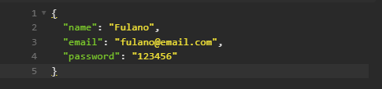
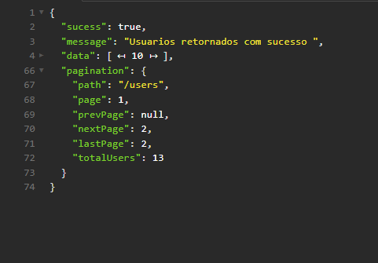

# Nesta POC será abordado paginação

## Instalação

### Clonar projeto

```bash
$ git clone https://github.com/EmanoelSaraiva/poc_pagination.git
```

Necessário ter NODE instalado

```bash
$ yarn install
```

### Executar app

```bash
$ yarn start
```

### Cadastro de novos usuários:

O que deverá ser enviado para cadastro



### Resposta esperada:

Após cadastrar usuários e listalos é esperado o seguinto retorno do /users


